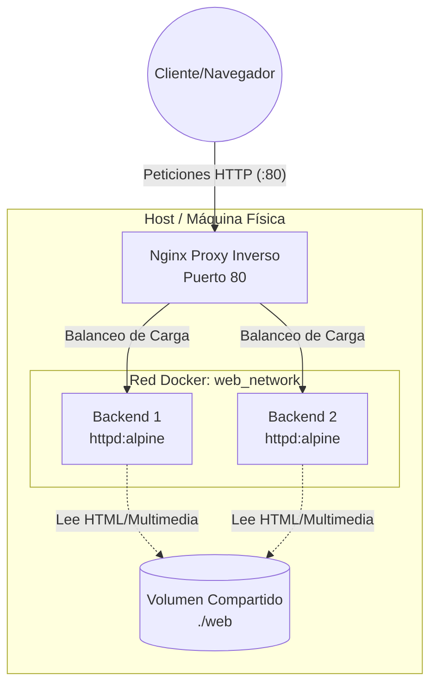

## 1. Esquema de la Arquitectura

A continuación se muestra el diagrama de cómo interactúan las distintas piezas de nuestra infraestructura:



## 2. Decisiones de Diseño y Justificación

### Elección de Imágenes Docker
Para el **proxy inverso**, he seleccionado la imagen oficial `nginx:alpine`. Nginx es un estándar de la industria, conocido por su alto rendimiento y su especialización para actuar como balanceador de carga y proxy. Elegí la variante `alpine` porque es una distribución de Linux extremadamente ligera y segura, lo que reduce la superficie de ataque y el consumo de recursos.

Para los **servidores backend**, he optado por `httpd:alpine` (Apache). Decidí usar Apache en los nodos en lugar de repetir Nginx para que quede visualmente y arquitectónicamente clara la separación de roles: Nginx se encarga exclusivamente de enrutar y Apache se encarga exclusivamente de servir el contenido web estático. Al igual que con el proxy, usar Alpine asegura que los contenedores arranquen de forma casi instantánea.

### Diseño de la Red y Aislamiento (Seguridad)
He creado una red personalizada de tipo *bridge* llamada `web_network`. 
La principal decisión de diseño aquí ha sido la **seguridad**. En mi archivo `docker-compose.yml`, los backends (`web-backend1` y `web-backend2`) **no exponen ningún puerto** hacia la máquina anfitriona (host). Si alguien intenta acceder a ellos directamente desde el exterior saltándose el proxy, no podrá. Solo el contenedor del proxy expone el puerto `80`. Al estar todos unidos mediante la `web_network`, el proxy es el único autorizado para comunicarse internamente con los servidores Apache.

### Estrategia del Volumen Compartido
El contenido estático (nuestro texto, una imagen y el archivo de vídeo HTML5) reside físicamente en la carpeta `./web` del host. He montado este directorio como un volumen de solo lectura (`:ro`) en ambos backends (en la ruta `/usr/local/apache2/htdocs/`). Esto garantiza un "estado único de la verdad": sin importar a qué nodo envíe Nginx nuestra petición, el cliente siempre verá la misma versión exacta de la página web sin desincronizaciones.

---

## 3. Comandos para Levantar y Verificar el Entorno

### Arrancar la Infraestructura
Para desplegar todo el entorno de forma automática y dejarlo ejecutándose en segundo plano, sitúate en la raíz del proyecto (`prova-prova`) y ejecuta:
```bash
docker compose up -d
```
Para comprobar que la red se ha creado y que los tres contenedores están activos:
```bash
docker compose ps
```

### Verificación del Balanceo de Carga
Para demostrar que la infraestructura funciona según los requisitos y que el proxy distribuye las peticiones añadiendo nuestra cabecera personalizada `X-Backend-Server`, podemos realizar peticiones HTTP directamente desde la terminal leyendo las cabeceras de respuesta.

Si lanzamos el siguiente comando un par de veces seguidas:
```bash
curl -I http://localhost
```

Podemos observar en la respuesta final cómo la IP interna cambia, demostrando que el balanceo Round-Robin está activo:

* **Petición 1:** En las cabeceras obtenemos `X-Backend-Server: 172.x.x.2:80` (La petición la resolvió el Backend 1).
* **Petición 2:** Al repetirlo obtenemos `X-Backend-Server: 172.x.x.3:80` (La petición la resolvió el Backend 2).

Con esto queda demostrada la correcta implementación de la alta disponibilidad y el aislamiento requeridos.

Muestras del correcto funcionamiento.
El Proxy en funcionamiento y la Red Aislada


Balanceo de carga con Round Robin.


Frontend


